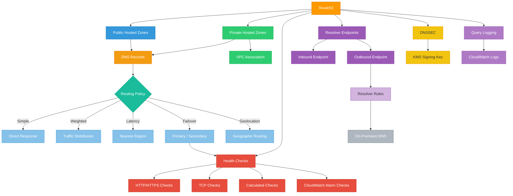

# terraform-aws-route53

Terraform module for managing AWS Route53 hosted zones, DNS records, health checks, routing policies, DNSSEC, query logging, and resolver endpoints.

## Architecture



## Features

- **Public Hosted Zones** - Internet-facing DNS zones
- **Private Hosted Zones** - VPC-scoped DNS zones with VPC associations
- **DNS Records** - A, AAAA, CNAME, MX, TXT, SRV, and alias records
- **Routing Policies** - Weighted, latency-based, failover, and geolocation routing
- **Health Checks** - HTTP, HTTPS, TCP, calculated, and CloudWatch alarm checks
- **DNSSEC** - Zone signing with KMS-managed keys
- **Query Logging** - DNS query logs to CloudWatch
- **Resolver Endpoints** - Inbound and outbound DNS resolvers for hybrid environments
- **Resolver Rules** - Conditional forwarding rules with VPC associations

## Usage

```hcl
module "route53" {
  source = "path/to/terraform-aws-route53"

  name = "my-dns"

  public_zones = {
    "example.com" = {
      comment = "Primary domain"
    }
  }

  records = {
    www = {
      zone_key = "example.com"
      name     = "www.example.com"
      type     = "A"
      records  = ["10.0.1.100"]
    }
  }

  tags = {
    Environment = "production"
  }
}
```

## Examples

- [Basic](examples/basic/) - Public zone with simple records
- [Complete](examples/complete/) - Full setup with routing policies, health checks, and resolvers

## Requirements

| Name      | Version  |
|-----------|----------|
| terraform | >= 1.5.0 |
| aws       | >= 5.0   |

## License

MIT License - see [LICENSE](LICENSE) for details.
